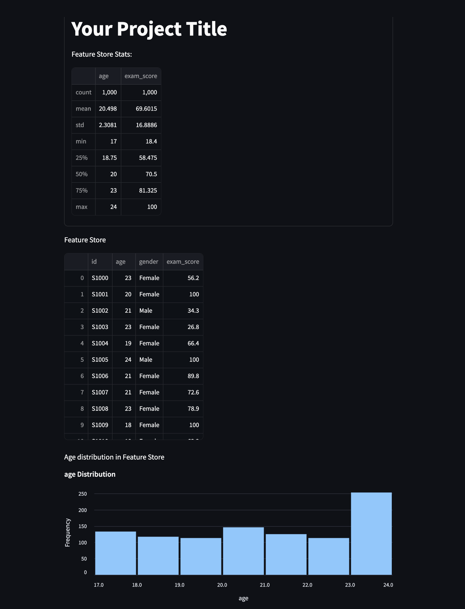

# Lagerhaus Feature Store

> **Note**: This package is a proof-of-concept and is not intended for production use.

This is a feature store integrating data cleaning, an artefact of our Bachelor's thesis _"Developing a Feature Store Library with Built-In Data Cleaning Support"_ by [Michael König](https://www.linkedin.com/in/koenig-michael/) and [Sofia Serbina](https://www.linkedin.com/in/sofia-serbina-2b7182264/).

---

## Usage

### Installation

Since this package is more of a proof-of-concept, we decided not to publish it on PyPI.
Instead, you can install the package using pip:

```bash
pip install git+https://github.com/koenigscode/lagerhaus.git@main
```

If the package is already installed and you want to update it
(but the semver version hasn't changed), you have to uninstall the package first,
due to caching.

### Feature Store and Feature View

The Lagerhaus feature store revolves around a pandas DataFrame.
Once you have a DataFrame, specify the metadata for the columns and create a FeatureStore:

```bash
df = pd.read_csv(...)

metadata = {
    "id": FeatureMetadata(description="Student ID", from_col="student_id", dtype=str),
    "age": FeatureMetadata(description="Student Age", dtype=np.float64),
    "gender": FeatureMetadata(description="Student Gender", categorical=True, dtype=str),
}

fs = FeatureStore(metadata=metadata, df=df
```

You can then use feature views for different views on the data for different
types of ML models that consume the data. For example, when consuming the data
for use in a linear regression model, you might want the data preprocessed in
a different way then when using a decision tree model.

For example, for creating two different views based on the feature store from before:

```bash
linear_fv = FeatureView(feature_store=fs, transformers=presets.linear_regression)
decision_tree_fv = FeatureView(feature_store=fs, transformers=presets.decision_tree)
# Optional: You can also provide a whitelist of features
```

### Statistics

There is also a simple web-based statistics module that uses streamlit:

```bash
from lagerhaus import stats

stats.init("Your Project Title", fs) # basic feature store statistics
stats.print(fs, title="Feature Store") # Shows the data of the DataFrame
stats.plot_distribution(fs.get_all(), "age", title="Age distribution in Feature Store")
```



---

## Library Development

To work on the library itself, follow these steps:

### Setup

(Recommended: Use a virtual environment)

```bash
python3 -m venv venv
source ./venv/bin/activate
```

Install the requirements:

```bash
pip install -r requirements.txt
```

### Test / Example

To run the example, which includes a web-based UI, use streamlit:

```bash
python -m streamlit run tests/test.py
```
